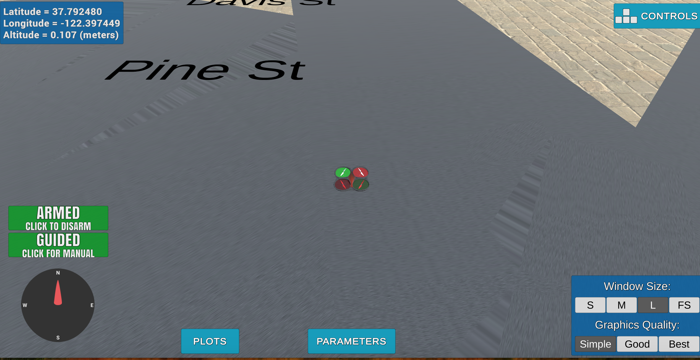

# Motion Planning

## Starter Code: plan_path

The plan path function creates a set of waypoints from start to goal. This function creates the grid and defines the start position as the map center and goal position as a location 10 m north and 10 m east of map center. The path is calculated using a-star algorithm and then send to the simulator. In the backyard flyer, the path is a square shape.

## Path Planning Algorithm

#### 1. set home position
Read the first line of the collider.csv using ***csv*** module and then removed the string literal to convert the values in floating point.

#### 2. Set your current local position
I took the values from self._longitude, self._latitude and self._altitude converted from using function ***global_to_local*** and getting global_home from ***self.global_home***.

#### 3. Start position
Currently, current position is set as map center.

#### 4. Goal position
I have hardcorded goal location at far place behind building then converted the latitude and longitude of goal position to NED frame position.

#### 5. Path Search algorithm
##### Approach 1: A-star 
Added diagonal motion as NORTH_WEST, NORTH_EAST, SOUTH_WEST and SOUTH_EAST to A* implementation with a cost of sqrt(2) in planning_utils.py .

##### ~~Approach 2: Potential based Bidirectionalized RRT*~~
~~The implementation this algorithm is in rrt_planning.py file. In this method, we map the optimal path by generating Rapidly-exploring Random Tree from both start position and goal position. This approach is based on the below mentioned papers. Also, you can find a PBRTT.ipynb ipython notebook containing the graphs of RRT, RRT* and BiRRT* for your reference.~~
1. https://arxiv.org/pdf/1703.08944.pdf
2. https://arxiv.org/pdf/1807.08325.pdf

#### 6. Cull waypoints
In this step, collinearity check is used to prune the path. This removes unnecessary waypoints from the path.
